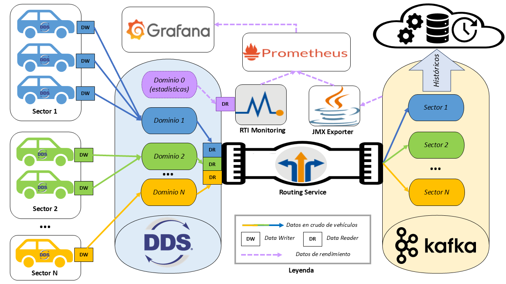

# TFM
Material desarrollado y empleado a lo largo del Trabajo de Fin de Máster: *Evaluación de sistemas de distribución para la automatización de aplicaciones industriales inteligentes*.

------------------------------------------

## Resumen:

La digitalización de los sistemas industriales y la creciente complejidad de las arquitecturas distribuidas han dado lugar a la necesidad de plataformas tanto robustas como escalables para la distribución de datos, especialmente en escenarios que combinan el procesamiento en la nube y en el borde de la red *edge*, permitiendo de esta forma también la comunicación en tiempo real o la reducción de latencias cuando sea necesario, siendo este un paradigma que se conoce como IoT Continuum. En este contexto, DDS (Data Distribution Service) y Apache Kafka se posicionan como tecnologías de referencia, cada una con fortalezas diferenciadas: DDS orientado a entornos con baja latencia o mayor criticidad, y Kafka como solución para aplicaciones que requieren el manejo de grandes volúmenes de datos y altas capacidades de procesamiento en la nube.

Este Trabajo de Fin de Máster propone una arquitectura de integración entre DDS y Kafka, utilizando para ello herramientas como Routing Service, proporcionadas por RTI Connext DDS, siendo este uno de los *frameworks* más relevantes en el ámbito de DDS y la interconexión de aplicaciones distribuidas. El trabajo se centra en el diseño, implementación y evaluación de esta interconexión, empleando un caso de uso representativo con capacidad de monitorización tanto de Kafka como DDS.

Asimismo, también se ha desarrollado una automatización del despliegue de las herramientas a utilizar, permitiendo replicar el entorno en diferentes máquinas y facilitando la escalabilidad del sistema y la evaluación en escenarios distribuidos. De esta forma, se pretende demostrar la viabilidad técnica de la interoperabilidad entre ambos *middlewares*, sentando posibles bases para aplicaciones industriales que requieran combinar un alto rendimiento en la gestión de datos con un procesamiento distribuido de baja latencia.

------------------------------------------
## Memoria:

*Pendiente de publicación*

------------------------------------------

## Estructura del repositorio:
* **Benchmark**: Código utilizado para la ejecución automatizada de tests reducidos de rendimiento para Kafka/DDS. Se encuentra organizado en función de las métricas:
  - Latencia
  - *Throughput*
A su vez, para cada métrica, se puede estudiar el material ofrecido en función del *middleware* empleado:
  - DDS
  - Kafka
También incluye las imágenes de las figuras generadas, la colección completa de resultados en JSON y el código empleado en la generación de las figuras.
* **Dataset**: Recoge la sección empleada del *dataset* y el código correspondiente a su procesado y los CSV resultantes para cada vehículo.
* **Deploy_Scripts**: *Scripts* utilizados para la automatización de la instalación de dependencias necesarias, preparación de entornos y ejecución de vehiculos.
* **Simulation**: Código utilizado para la ejecución del caso de uso simulado, así como la configuración de los servicios de enrutamiento y monitorización. Se divide en los siguientes directorios.
  - Aggregator: Agregación de información de dominios y configuración de enrutamiento entre dominios.
  - Bridge: Configuración de enrutamiento entre DDS y Kafka.
  - DataTypes: Tipos de datos que se utilizan en el caso de uso.
  - Monitoring: *Exporters*, *dashboards* de Grafana y captura de métricas desde *endpoints* por Prometheus.
  - VehicleSimulation: Código encargado de simular la publicación de datos por un vehículo.

------------------------------------------

## Arquitectura y solución software empleada:

------------------------------------------

## Fuentes de datos:
* **Datos DeepSense6G - Scenario 36**: https://www.deepsense6g.net/scenarios36-39

------------------------------------------

## Contacto:
* **Autor**: Mario Martín Pérez (mario.martinperez@unican.es)
